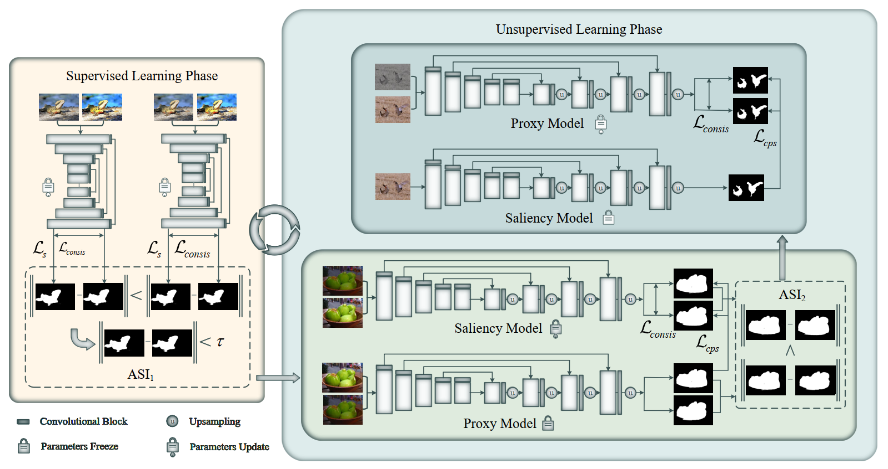
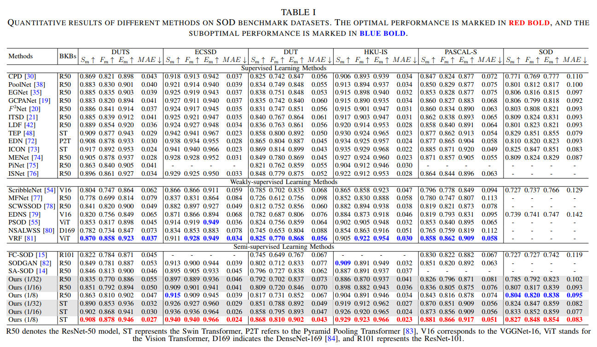

## <p align=center> `Consistency-Guided Adaptive Alternating Training for Semi-Supervised Salient Object Detection (TCSVT 2025)` </p>
> #### Liyuan Chen, Wei Liu, Hua Wang, Sang-Woon Jeon, Yunliang Jiang, Zhonglong Zheng </sup>


<font size=7><div align='center' > <a href=https://ieeexplore.ieee.org/document/10876394>**Paper**</a> | [**Training**](#training) | [**Testing**](#Testing) | [**Pre-trained Model**](#training)  </div></font>




## Highlight 

This work presents an innovative dual-model alternating training framework. Two independent models dynamically alternate roles as proxy and saliency models through Adaptive Selection Indicators (ASI), effectively utilizing unlabeled data while suppressing the accumulation and propagation of pseudo-label errors. ASI evaluates model robustness by measuring prediction consistency between original images and their color-transformed versions, automatically identifying the more robust model to guide the learning of the other. This design is both simple and efficient, requiring neither complex modules nor carefully tuned thresholds.


## Dataset configuration

- For the training setup, update the `--training_path` parameter in the `config.py` file to your training data path, e.g., `training_path='./your_path/DUTS/'`.
- For the testing, update the `--test_dataset_root` parameter in the `config.py` file to point to your testing data path, e.g., `test_dataset_root='./your_testing_data_path/'`.


## Training

```shell
    cd src
    python train.py
```
- `Swin Transformer` is used as the backbone and `DUTS-TR` is used to train the model, you can replace it with other networks and backbones.
- `batch=8`, `epoch=30`
- After training, the result models will be saved in `./experiments/SOD_vitb_rn50_384_6e-05_swin_REMOVE/models/` folder

## Testing

```shell
    cd src
    python test.py
```
- After testing, saliency maps of `PASCAL-S`, `ECSSD`, `HKU-IS`, `DUT-OMRON`, `DUTS-TE` will be saved in `./results_mean/` folder.


## Result

+ Comparison with the previous state-of-the-art methods with different training sets:




## Trained Model

You can test our model on your own datasets. The pre-trained model is available for download below.

Baidu disk(https://pan.baidu.com/s/1jDu-k40QcTTCjivEImV6Ag?pwd=vimv 提取码: vimv)

Google drive(https://drive.google.com/drive/folders/1vIe22mc9QfK-UB866_JNWxtAfyG0GgMA?usp=drive_link)


## Saliency Maps
Results of our model on benchmark datasets(DUTS, DUT-OMRON, ECSSD, PASCAL-S, HKU-IS, SOD, MSRA-B, MSRA-10K, THUR15K) can be found:

Baidu disk(https://pan.baidu.com/s/1IEGrpVX8J7lvhjOWeEnDGw 提取码: u2dm)

Google drive(https://drive.google.com/drive/folders/1vjrYfkD6nj0fDIq7c2wwbtHh1hOZg7_c?usp=drive_link)


## Acknowledgement

We appreciate the codebases of [TEP](https://github.com/JingZhang617/EBMGSOD).


